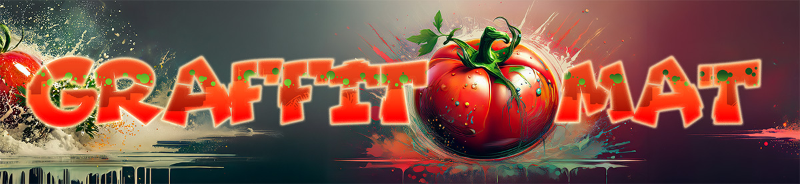
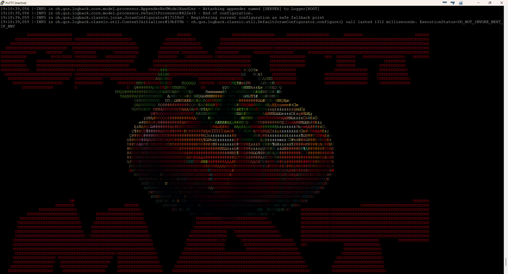
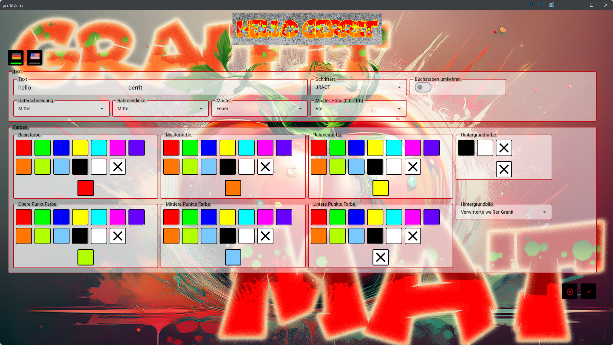

= Graffitomat
:doctype: book
:description: Documentation for Graffitomat
:keywords: kotlin, photo presentation
:icons: font
:toc:
:toc-title: Contents
:toclevels: 10

== Status

https://github.com/sknull/graffitomat/actions/workflows/github-ci.yml[image:https://github.com/sknull/graffitomat/actions/workflows/github-ci.yml/badge.svg[Graffitomat]]

== Motivation

This project tries to solve a problem of the Miniaturwunderland Hamburg regarding generating Graffiti Images to show them on a tiny display attached to a Rapsberry PI or similar.
The showcase can be found in this youtube video at 12 Minutes:

https://www.youtube.com/watch?v=yhFqaXid6zU

From what I have seen it seems they are using an AI approach which takes a lot of time to generate and is error prone.
It came to my mind that it might be a better approach to do it in the classic way by using actual Fonts, so I started research and experimenting with a tiny 320x240 pixel touch display which I had flying around attached to a Raspberry PI 4 with plenty as 8GB RAM.

As I worked with Spring Boot and Kotlin as a professional developer and learned Kotlin Multiplatform over the last months this ended up as the ideal techstack to build on.

My current implementation is a client server solution which offloads the rendering and displaying of the final images to the raspberry pi which runs a little spring boot server.

The client is implemented using Kotlin multiplatform and can run on the desktop as well as on android devices. Theoretically it would also be possible to run on linux and mac os but I have not the equipment to actually bvuild for these platforms. So for now I am stuck with Windows and Android - which is good enough for a proof of concept.

== Features

Form to input and preview a text.
You can configure some aspects of the final graffito:

- font to use (choice of some prepared fonts which provide separate filled and outlined flavor)
- base color
- outline color
- some pattern which can overlay the text body (choice of some ready mades)
- pattern color
- color of additional dots on the top, middle and bottom (also filling the text body and overlaying the pattern)
- colors for the three different dot patterns
- background color
- background image

== Goal

Well - currently I am without a day job and this project could be a great demo for an application ;)

For this reason I do not share the code currently.

So if you want a demo Wunderland - just contact me.

== Screenshots

=== Backend

=== Frontend

